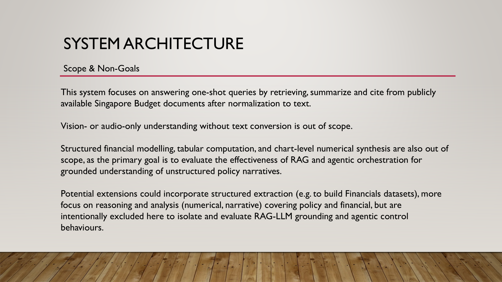
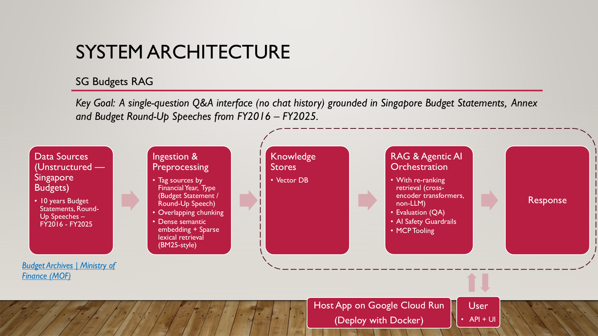
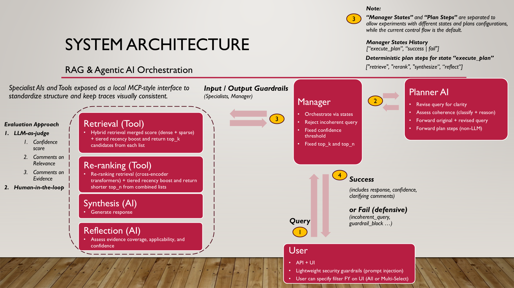
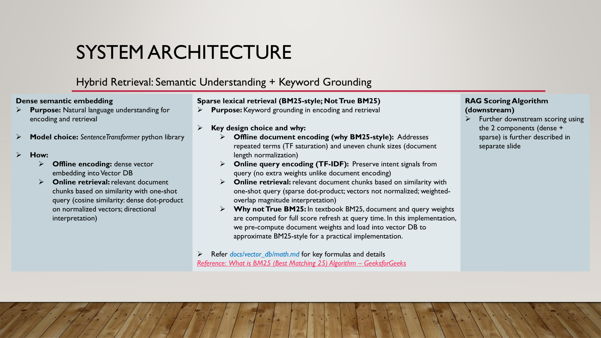
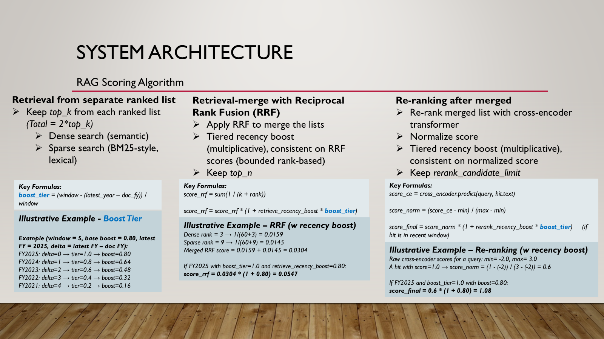
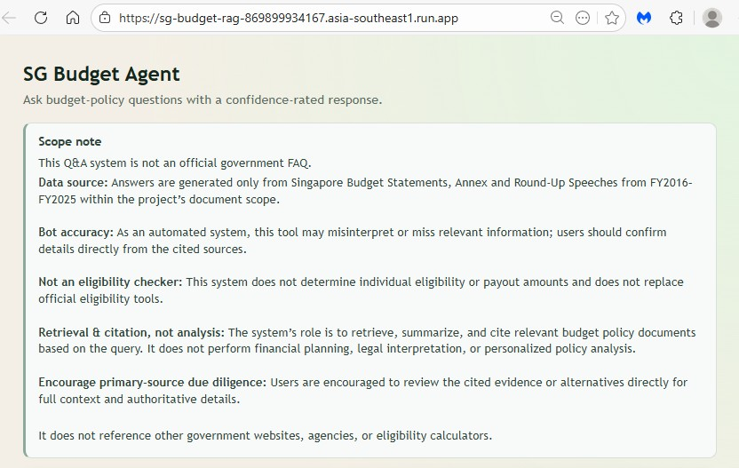
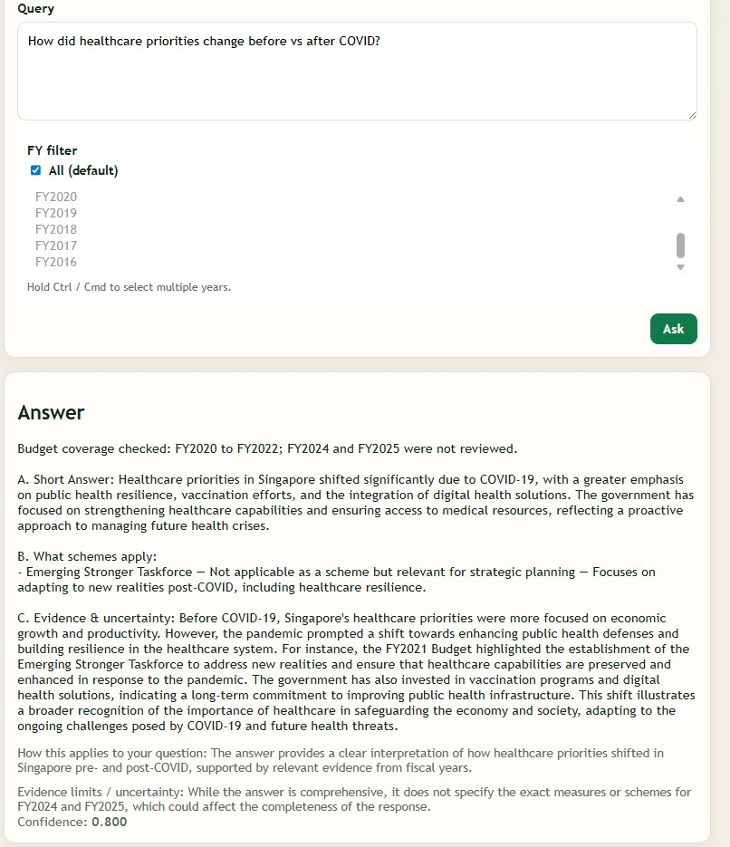

# dataexpert-ai-capstone-sg-budget-rag

> This should read like an operational manual for developers.

## Start Here (Developer + Operator Guide)

1. [`docs/agents/README.md`](docs/agents/README.md) - module map, call flow, and where to edit.
2. [`README.dev_review.md`](README.dev_review.md) - developer-friendly top‑down review path.
3. [`docs/api/README.md`](docs/api/README.md) - API + frontend runbook.
4. [`docs/agents/runtime.md`](docs/agents/runtime.md) - CLI runbook for quick local debugging without the API/UI, plus env vars and failure modes.
5. [`docs/agents/contracts.md`](docs/agents/contracts.md) - manager state machine and trace contracts.
6. [`docs/tests/README.md`](docs/tests/README.md) - tests overview (unit + integration).

   > Integration test outputs are written to `logs/integration/` (tracked in git).

7. [`docs/vector_db/load_data.md`](docs/vector_db/load_data.md) - vector DB ingestion/runbook for `src/vector_db/load_data.py`.
8. Continue below in this `README.md` for quickstart and environment setup.
   > Defaults for runtime knobs live in `src/agents/core/config.py`.
   >
   > Deployment guide: [`README.deployment.md`](README.deployment.md)
   

## Quickstart

### 1) Install dependencies

```bash
python -m venv .venv
source .venv/bin/activate
pip install -r requirements.txt
```

## Environment Variables
`.env` files are loaded automatically if present.

Required:
- `OPENAI_API_KEY`
- `MILVUS_URI` (base URL, e.g. `https://<cluster-endpoint>`)
- `MILVUS_TOKEN` (Zilliz Cloud bearer token)

Optional:
- `MILVUS_DB` (can leave it unset as None with no defaults; Milvus should work just fine using "default")

## API + Frontend

For API + frontend run instructions and endpoints, see [`docs/api/README.md`](docs/api/README.md).


---
## Capstone Rubrics Review

May contain duplicate references with above.

### RAG Code Overview
---
- Reference: [`README.dev_review.md`](README.dev_review.md)
   - Guardrails: input/output toxicity checks via GuardrailsAI (`src/agents/guardrails/service.py`), plus prompt‑injection screening (`src/api/security.py`).
   - Re‑ranking: cross‑encoder rerank in `src/agents/specialists/rerank.py`.
   - Embeddings: Milvus collection populated with >1,000 chunks (see ingestion runbook).
   - Integration test: `scripts/run_rag_integration_queries.py` / (5 queries) + `logs/integration/` (test results).

### Deployed on a live site
---
- Live app: [https://sg-budget-rag-869899934167.asia-southeast1.run.app/](https://sg-budget-rag-869899934167.asia-southeast1.run.app/)
- Expecting to take it offline after capstone grading due to limited free trial hosting

### Project Scoping + Project Specs
---

> **Reference:** `docs/system_architecture.pptx`
>
> Capstone is implemented end-to-end with an use case using real world datasets

#### Scope & Non-Goals + System Architecture Diagrams + Key Algorithm Discussions

<details>
<summary>Show Scope & Non-Goals</summary>


</details>

<details>
<summary>Show System Architecture Diagrams</summary>



</details>

<details>
<summary>Show Key Algorithms Discussions</summary>



</details>

#### UI + example queries screenshots
> **Reference:** `screenshots/`

<details>
<summary>Show UX Screenshots</summary>



</details>

### Write Up
---

#### Expected outputs
> A single-question Q&A interface (no chat history) grounded in Singapore Budget Statements,  Annex and Budget Round-Up Speeches from FY2016 – FY2025.


#### Dataset + tech choices (with justification)

> Singapore Budget Statements and related documents are used in this project because it is close to home for the developer and may be more relatable for audience during demo.
>
> It is explicited capped to text documents for project scoping to be more focused within constraints.


| Tech choices | Justification
|---|---|
| Key RAG algorithms | Included in above under `system_architecture` > **Key Algorithm Discussions** |
| Milvus DB + Zilliz Cloud | Open-source Vector DB, while managed Milvus (Zilliz Cloud) has free tier available |
| FastAPI | Modern, high-performance Python web framework that simplifies the creation of web APIs |
| Google Cloud Run | Fully managed application platform which we use for full-stack deployment which is good for AI Engineering packages which can be heavy. |


#### Steps + challenges


> **System steps (aligned to architecture)**
> - Ingest PDFs → chunk and tag metadata
> - Embed dense + sparse vectors → load into Milvus
> - Retrieve hybrid candidates (dense + sparse)
> - Merge + recency boost → rerank with cross‑encoder
> - Synthesize grounded answer + citations
> - Reflect for confidence + applicability/uncertainty notes
> - UI displays answer + metadata


| Steps | Challenges
|---|---|
| Scoping (Failure Risk) | Hard to scope use cases that are both feasible and impactful for a local dev demo. It's possible for projects to fail in the midst of design or implementation due to non-feasibility of initial goals or unsatisfactory evaluation results while reassessing project ROI. |
| Scoping (Ingestion) | For example, there are incremental cost/efforts to ingest more diverse sources of data like non-text, convert video to transcripts or other relevant sources like government sites,  which can enable re-designing the scope and design to unlock analysis abilities as a different persona. Thoughts also went into ingesting structured financial datasets to unlock numerical analysis capabilities but determined that is not the core scope for this demo, which is to work with unstructured narratives instead of numerical analysis of which the financial domain can reveal additional challenges. |
| Evaluation (Expectations) | When dealing with real use cases, expectations can be difficult to meet and so having a theoretical baseline and clear communication of project objectives are quite important to manage. This is especially so for projects that require human-in-the-loop, with no clear illustrative examples for evaluation. One way of managing that in this project is to deploy a Reflection AI to act as LLM-as-judge to generate supporting metrics like confidence score,  and commenting on relevance and evidence from the Synthesis AI response. During development, a human-in-the-loop evaluate the results and adjust accordingly including prompts iteration and reflect on scoping.


#### Potential Future enhancements
> Included in above under `system_architecture` > **Scope & Non-goals**.
>
> *Potential extensions could incorporate structured extraction (e.g. to build Financials datasets), more focus on reasoning and analysis (numerical, narrative) covering policy and financial, but are intentionally excluded here to isolate and evaluate RAG-LLM grounding and agentic control behaviours.*


### Vectorizing unstructured data
---
> Loading data into vector DB and related data quality checks for each source are documented in [`docs/vector_db/load_data.md`](docs/vector_db/load_data.md).
>
> Data quality checks include FY token in filename, directory convention, non‑empty extracted text.
